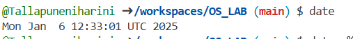

# OS_LAB
Operating System Lab
Basic UNIX Commands Practice Outputs
##general commands outputs

manual date command [manualdate.png]
mdate+%d.png
mdate+%t.png
mdate+%y.png
mdate+%h.png
calendar[mcal.png]
manual cal.png
mcal year.png
mcal month year.png
mwho.png
manual who.png
mwho am i.png
mtty.png
manual tty.png
muname.png
manual uname.png
muname -r.png
muname -n.png
mecho text.png
manual echo.png
mecho $home.png
mbc.png
manual bc.png
mhistory.png
mpwd.png
manual pwd.png
mkdir lab.png
mkdir oslab.png
manual mkdir.png
mkdir dir1 dir2.png
mcd subdir.png
mcd.png
mcd1.png
mcd.. .png
mcat filename.png
manual cat.png
mcat filename1.png
mcat filename2.png
mcp src des.png
mcp -i src des,png
manual cp.png
mcp -r src des.png
mmv old new.png
manual mv.png
mv f1 f2 f3 dir.png
mmv -v old new
mrm file.png
manual rm.png
mrm1.png
mrm -r.png
mrm -f.png
mls.png
manual ls.png
mls file.png
msl file1.png
mls -a.png
mls -xdirname.png
mls-r.png
mls -l.png
mcmp file1 file2.png
manual cmp.png
mchmod g-r.png
manual chmod.png
mchmod 740file.png
